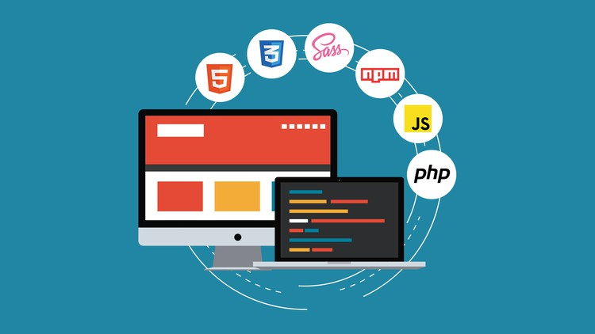

# CURSO DE DESARROLLO WEB COMPLETO - HTML - CSS - JS - AJAX - PHP - MYSQL

---



---

### Clase 01 - Proyectos a implementar

- Sitio de conferencias con pagos en línea.
- Sitio web para inmobiliaria.
- Sitio web para salón de belleza.
- Sitio web para administrar tareas.
- Proyectos con HTML, CSS Fetch  y SASS
- Proyecto con HTML, CSS y JS.
- Tecnologías y versiones del curso.

### Clase 02 - Áreas del desarrollo web

- ¿Qué es y que hace un desarrollador FrontEnd?
- ¿Qué es y que hace un desarrollador BackEnd?
- ¿Qué es y que hace un desarrollador FullStack?

### ¿Cómo aprovechar el curso?

- Recomendaciones: 
    - Todos aprendemos de forma diferente.
    - El código nunca se memoriza.
    - no saltar videos ni acelerar más de lo necesario.
    - Practica, Practica y Practica.
    - ¿Cómo manejar los problemas?
        - Es parte de la programación.
        - Ve a tu ritmo.
        - Paciencia con la sinsteaxis del código.
        - No es imposible pero tampoco es fácil.
        - El nivel de complejidad irá subiendo conforme avances.
        - Cometer errores es lo más normal.
    - ¿Cómo solicitar ayuda?
        - No tengas miedo a preguntar.
        - Busca varias fuentes.
        - Revisar la sección de preguntas del curso.
    - Editor de código
        - VSCode

### Sitio FreeLancer - HTML Paso a Paso

##### HTML 
- Es un lenguaje de modelado, sirve para estructurar nuestro sitio web, es basicamente el esqueleto de nuestro sitio.
- Funciona en base a etiquetas que representan un tipo de contenido.
- Tiene etiquetas semánticas, es decir, etiquetas que le dan mayor sentido al contenido del sitio.

##### Primer Proyecto
- Empezando con HTML
    - Etiquetas base del proyecto FreeLancer.
    - Estructura (semántica) del contenido del proyecto Freelancer.
    - Enlaces y navegación
    - uso de íconos (https://tablericons.com/)
    - Agregamos iconos al proyecto Freelancer
    - Trabajamos con formularios HMTL

- La importancia de CSS
    - Colores, tamaos, espacios, animacioens y demás.
    - Es la forma en la que mejoramos el diseño de nuestros sitios web.
    - Estructura base
        ```CSS
            p {
                color: blue;
            }
        ````
- Anatomía de CSS, en la estructura enterior:
    - p: es la etiqueta o selector al que queremos aplicar estilos.
        - Las llaves {}: agrupan las propiedades y valores CSS.
    - Estilos del sitio web Freelancer.
    - Tamaños de texto (px, em, rem)
    - Formas de escribir selectores
        - Selector de elemento: en base a su etiqueta.
            ```CSS
                p{
                    color:blue;
                }
            ```
        - Selector de clase: identificado por un punto en CSS.
            ```CSS
                .parrafo {
                    color:blue;
                }
            ```
        - Selector de Id: identificados en css con un símbolo de #. Solo se puede usar una vez.
            ```CSS
                #parrafo{
                    color:blue;
                }
            ```
        - Slector de atributo: basados en algún atributo.
            ```CSS
                [src="logo.jpg"]{
                    color:blue;
                }
            ```
       
        - Combinación descendente: agrupando clases.
            ```CSS
                .parrafo .texto{
                    color:blue;
                }
            ```     
        - selectores hijos: slecciona a todos los elementos p dentro de la clase cliente.
            ```CSS
                .cliente > p{
                    color:blue;
                }
            ```
        
- Especificidad en CSS:

    - hay selectores que son más específicos que otros.
    - el id es más específico que la clase.
    - El selector !important es el más específico de todos
    - los estilos en linea son más específicos que los de clase.
    - las clases son más espesíficas que los selectores de elementos.
    - y todos los anteriores son más espefícos que el selector universal *.
    - En resumen la jerarquía ed especificidad sería la siguiente:
        <pre>
            <code>
            !important           = 1,0,0,0,0
            Selector de id #     = 0,1,0,0,0
            estilos en línea     = 0,0,1,0,0
            Selector de clase    = 0,0,0,1,0
            Selector de elemento = 0,0,0,0,1
            Selector universal * = 0,0,0,0,0   
            </code>          
        </pre>
    - La especificidad le dice al navagador como mostrar el css que estamos utilizando de acuerdo a que tan específico es el selector utilizado.
    - No se reomienda el uso del selector !important a no ser que no quede otra alternativa.

- Colores en CSS:
    - Hay vartias formas de definir colores en css, por nombre, hexadecimal, hsl rgb, rgba...
    ```CSS
        p{
            color:blue;
            color:#000;
            color:rgb(); /*red, green, blue*/
            color:rgba(); /*red, green, blue, transparency*/
            color:hsl(); /*hue, saturation, light*/
        }
    ```
    - Existen herramientas en línea que nos pueden ayduar con la selección de colores.

- Añadir fuentes externas de estilos a nuestro proyecto.
    - fuentes (https://fontsource.org/)
    - Google fonts (https://fonts.google.com/)
    - Agregando normalize.css el cual permite resetear los  estilos por defecto del navegador, aunque hoy en día, ya no se utiliza demasiado, sigue siendo una herramienta que nos puede servir para nuestro peoyectos (https://necolas.github.io/normalize.css/).

- Tabajando la navegaciónd el proyecto FreeLancer
    - 
